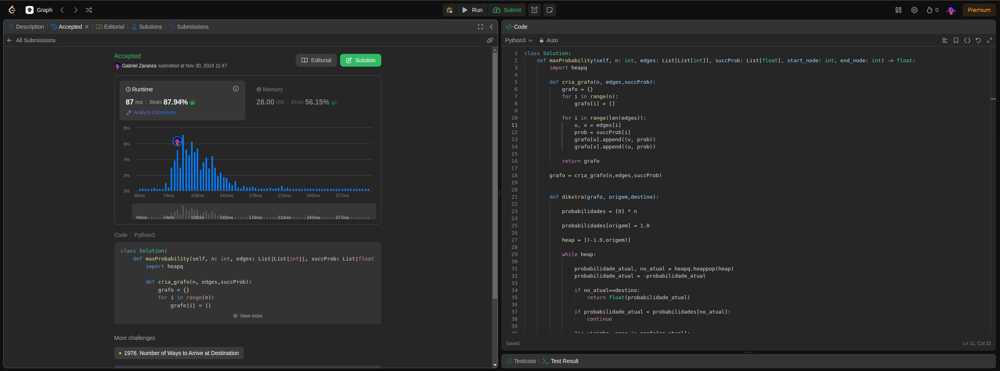
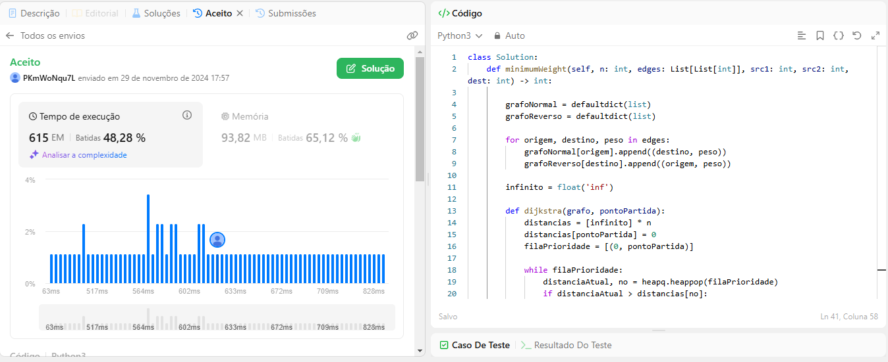
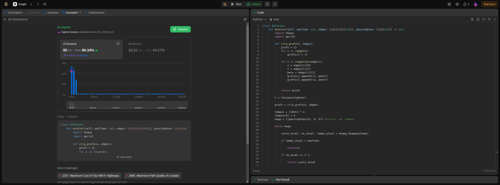

# LeetCode Problems

**Número da Lista**: 2 
**Conteúdo da Disciplina**: Grafos 2 
## [Para assistir a apresentação desta entrega, clique aqui!](https://youtu.be/L0S4liR292c)

## Alunos
|Matrícula | Aluno |
| -- | -- |
| 19/0107243  |  Gabriel Pessoa Zaranza |
| 21/1063149  |  Izabella Alves Pereira |

## Sobre 
Este projeto consiste na realização de exercícios da plataforma de juiz eletrônico LeetCode. Serão desenvolvidos problemas de média e alta complexidade, com ênfase nos conteúdos vistos no módulo de Grafos 2.

## Questões 

|Questão | Nível |
| -- | -- |
| [1514. Path with maximum probability](https://leetcode.com/problems/path-with-maximum-probability/description/?envType=problem-list-v2&envId=graph) |  Médio |
| [2203. Minimum Weighted Subgraph With the Required Paths](https://leetcode.com/problems/minimum-weighted-subgraph-with-the-required-paths/description/?envType=problem-list-v2&envId=shortest-path) |  Difícil |
| [1928. Minimum Cost to Reach Destination in Time](https://leetcode.com/problems/minimum-cost-to-reach-destination-in-time/description/?envType=problem-list-v2&envId=graph) |  Difícil |

## Screenshots

### 1514. Path with maximum probability

### 2203. Minimum Weighted Subgraph With the Required Paths

### 1928. Minimum Cost to Reach Destination in Time

## Instalação 
**Linguagem**: Python 

## Uso 

- Acesse o [LeetCode](https://leetcode.com/).
- Procure pelo problema ou busque pelo ID da questão que será testada.
- Cole o código na área de solução fornecida.
- Clique em "Run Code" para testar com casos de exemplo ou "Submit" para enviar a solução.
